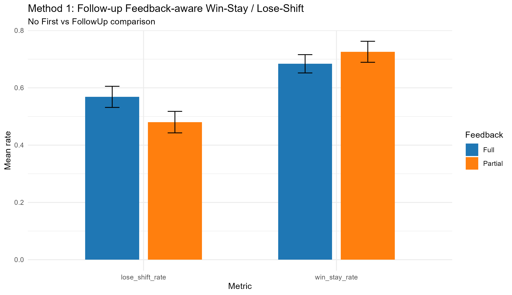
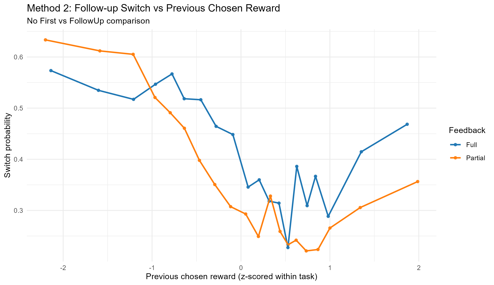
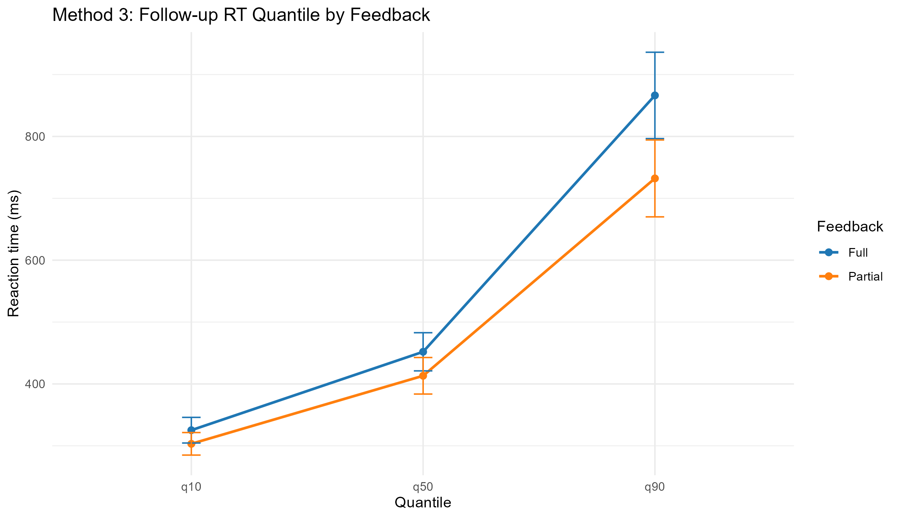

# Feedback-Aware Alternative Methods Report (Follow-up Only)

## Scope

- Dataset used: `myfullData_from_Pass4060_and_PartialPass4060.csv` only.
- No First vs FollowUp comparison in this report.
- Full vs Partial feedback is retained as the key contrast.

## Model Status

| Method | Model Class | Rows |
|---|---|---:|
| method1_wsls_feedback_aware_followup_only | glmerMod | 23716 |
| method2_switch_feedback_aware_followup_only | glmerMod | 23716 |
| method3_rt_quantile_feedback_aware_followup_only | lmerMod | 1452 |

## Method 1: Feedback-Aware Win-Stay / Lose-Shift

Model: `switch ~ prev_loss * feedback + framing + time_pressure + (1|participant) + (1|task)`

- `prev_loss` = 1.026 (p=<0.001).
- `feedbackPartial` = -0.301 (p=0.048).
- `prev_loss:feedbackPartial` = -0.079 (p=0.170).

| Feedback | Lose-shift mean | Win-stay mean |
|---|---:|---:|
| Full | 0.568 | 0.684 |
| Partial | 0.480 | 0.726 |

## Method 2: Feedback-Aware Switch Sensitivity

Model: `switch ~ feedback*prev_chosen_reward_z + prev_counterfactual_adv_z + ... + (1|participant)+(1|task)`

- `prev_chosen_reward_z` = 0.035 (p=0.163).
- `prev_counterfactual_adv_z` (Full-only signal) = -0.529 (p=<0.001).
- `feedbackPartial:prev_chosen_reward_z` = -0.558 (p=<0.001).

| Feedback | Slope of previous chosen reward |
|---|---:|
| Full | 0.035 |
| Partial | -0.523 |

## Method 3: RT Quantile Mixed Model

Model: `log_rt_quantile ~ feedback*quantile + framing + time_pressure + (1|participant)+(1|task)`

- `feedbackPartial` (q10 baseline) = -0.047.
- `feedbackPartial:quantileq50` = -0.029.
- `feedbackPartial:quantileq90` = -0.109.

| Feedback | Quantile | Mean RT (ms) |
|---|---|---:|
| Full | q10 | 325.2 |
| Full | q50 | 452.0 |
| Full | q90 | 866.3 |
| Partial | q10 | 303.2 |
| Partial | q50 | 413.2 |
| Partial | q90 | 732.2 |

## Bottom Line

- This report is restricted to follow-up data only.
- Feedback-aware coding is preserved: Full uses comparative signal; Partial uses chosen-only signal.

